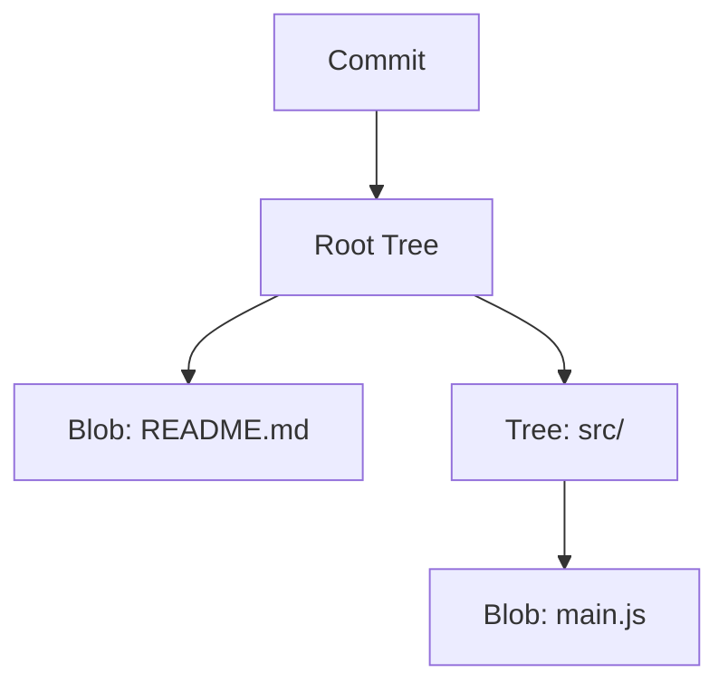

# Interní model dat: Pod kapotou Gitu

Tato kapitola zachází do technických detailů toho, jak Git ve skutečnosti ukládá svá data pod povrchem. Toto pochopení je rozdíl mezi uživatelem, který zná příkazy nazpaměť, a mistrem, který chápe následky svých akcí.

Když děláte commit, nevyrobíte "změnovou sadu" (diff). Vyrobíte hierarchii několika typů objektů, které nakonec odkazují na plný text vašich souborů.

Git je v jádru content-addressable filesystem (souborový systém s adresováním podle obsahu). To znamená, že jádro Gitu je jednoduché úložiště klíč-hodnota.

V adresáři `.git/objects` leží celá vaše historie. Jaké objekty tam ale žijí? Jsou čtyři hlavní typy:

## 1. Blob (Binary Large Object)
Když přidáte soubor do Gitu (např. pomocí `git add`), Git vezme obsah tohoto souboru, přidá k němu malou hlavičku, spočítá z toho celku SHA-1 hash (klíč), obsah zkomprimuje (zlib) a uloží jej do `.git/objects`. Tím vznikne objekt typu **blob**.

Důležité vlastnosti blobu:
*   **Blob reprezentuje POUZE obsah souboru.** 
*   **Neukládá název souboru.** Název souboru je uložen jinde.
*   **Neukládá žádná oprávnění.**
*   Pokud máte dva soubory s identickým obsahem (např. dva prázdné soubory `a.txt` a `b.txt`), Git je uloží jako **jeden jediný blob**. Tím ohromně šetří místo.

*Nízkoúrovňový příkaz: Obsah blobu (nebo jakéhokoliv objektu) si můžete vypsat pomocí `git cat-file -p <sha-1>`.*

## 2. Tree (Strom)
Jak už jsme zmínili, Blob v sobě nemá uložený název souboru. Od toho jsou tu Tree objekty (stromy). Strom reprezentuje adresář na vašem disku.

Stromový objekt je v podstatě seznam záznamů. Každý záznam obsahuje:
*   Mód (např. `100644` pro běžný soubor, `040000` pro podadresář).
*   Typ odkazovaného objektu (`blob` pro soubor, `tree` pro podadresář).
*   SHA-1 hash odkazovaného objektu.
*   Název souboru/adresáře.

Strom tedy seskupuje Bloby (soubory) a další Stromy (podadresáře) dohromady a dává obsahu strukturu. Jeden Tree objekt může kompletně definovat celý stav jednoho projektu ve specifický čas.

## 3. Commit
Nyní máme Stromy (adresářové struktury) a Bloby (obsah). Kdo ale říká, kdy se tento stav vytvořil, proč, a kdo za něj může? O to se stará objekt Commit.

Commit objekt je malý textový soubor (samozřejmě opět zahashovaný, komprimovaný a uložený v `.git/objects`), který obsahuje:
*   **Ukazatel na vrcholový Tree objekt:** Hash stromu, který reprezentuje root adresář projektu v době commitu (snímek dat).
*   **Ukazatel na rodičovské commity:** Pokud to není první commit v projektu, obsahuje hash předchozího commitu (nebo více commitů, pokud se jedná o merge commit).
*   **Autor (Author):** Kdo napsal kód (jméno a e-mail + timestamp).
*   **Zapisovatel (Committer):** Kdo to vložil do Gitu (může to být někdo jiný, např. při aplikování patche).
*   **Zpráva k commitu (Commit message):** Text s popisem změn.

## 4. Tag (Značka)
Posledním běžným typem objektu je Tag. Je to velmi podobné jako Commit objekt. Obsahuje ukazatel na nějaký jiný objekt (obvykle commit), tagující osobu, datum, zprávu a případně PGP podpis. Používá se pro označení důležitých milníků (verze, release - např. `v1.0.0`).

---

## Jak to do sebe zapadá

Představte si malý repozitář s jedním souborem `README.md` a složkou `src/`, ve které je `main.js`. 

1. Uložíte změny pomocí `git commit`.
2. Git vytvoří blob pro obsah `README.md`.
3. Git vytvoří blob pro obsah `main.js`.
4. Git vytvoří tree objekt pro složku `src/`, který bude mít jeden záznam: jméno `main.js` a ukazatel na blob `main.js`.
5. Git vytvoří root tree objekt, který bude mít dva záznamy: jméno `README.md` (s ukazatelem na jeho blob) a jméno `src` (s ukazatelem na tree z bodu 4).
6. Git vytvoří commit objekt, který obsahuje ukazatel na root tree objekt (z bodu 5) a metadata (autor, zpráva).

> [!TIP] Co se stane, když změníte jen `main.js` a vytvoříte nový commit?
> Git vytvoří nový blob pro nový obsah `main.js`. 
> Vytvoří se nový strom pro složku `src` (protože se změnil její obsah, tudíž i její hash).
> Vytvoří se nový root strom. Uvnitř tohoto nového root stromu bude pro záznam `src` ukazatel na nový `src` strom. Ale pro `README.md`? Odkaz se nezmění, Git znovu použije stejný ukazatel na původní blob `README.md`, protože jeho obsah se nezměnil.
> A nakonec se vytvoří nový commit, který ukazuje na tento nový root strom a obsahuje odkaz na předchozí commit jako na svého rodiče. 
> To dělá Git tak neuvěřitelně rychlým a úsporným i ve velkých projektech!
