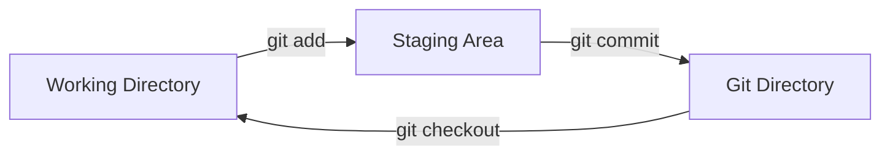

# Tři stavy Gitu

Tohle je nejdůležitější věc, kterou si musíte zapamatovat, pokud se chcete vyhnout frustraci. Git má tři hlavní stavy, ve kterých se mohou vaše soubory nacházet:

1. **Modified (Změněno)**: Změnili jste soubor, ale ještě jste ho neuložili do databáze (repozitáře).
2. **Staged (Připraveno)**: Označili jste změněný soubor v jeho aktuální verzi, aby šel do vašeho dalšího snímku (commit).
3. **Committed (Uloženo)**: Data jsou bezpečně uložena ve vaší lokální Git databázi.

Tyto tři stavy nás vedou ke třem hlavním sekcím jakéhokoli Git projektu.

## Architektura tří sekcí

### 1. Working Directory (Pracovní adresář)
Pracovní adresář je to, co vidíte ve svém editoru nebo prohlížeči souborů. Jedná se o jediný checkout jedné konkrétní verze projektu. Tyto soubory jsou vytaženy z komprimované databáze v repozitáři (adresář `.git`) a umístěny na disk, abyste je mohli používat nebo upravovat.
*   Zde probíhá veškerá vaše programátorská práce.
*   Soubory zde mohou být ve stavu "untracked" (Git o nich vůbec neví) nebo "tracked" (Git je sleduje).

### 2. Staging Area (Index)
Toto je často kámen úrazu pro nováčky. Staging Area je soubor, který je obvykle umístěn ve vašem `.git` adresáři. Obsahuje informace o tom, co půjde do vašeho dalšího commitu. Technický termín pro toto v Gitu je "index", ale fráze "Staging Area" (přípravná zóna) je běžnější.
*   Představte si to jako "nákupní košík" před tím, než zaplatíte u pokladny.
*   Pomocí příkazu `git add` vkládáte soubory z Working Directory do Staging Area.

### 3. Git Directory (Repozitář / databáze)
Git Directory (skrytý adresář `.git` ve vašem projektu) je místo, kam Git ukládá metadata objektů pro váš projekt. Toto je nejdůležitější část celého Gitu, a to je to, co se kopíruje, když zklonujete repozitář z jiného počítače.
*   Když provedete `git commit`, vezme se obsah Staging Area, vytvoří se z něj snímek, dostane trvalé identifikační číslo (SHA-1) a uloží se sem natrvalo do historie.

## Základní pracovní postup

Ve světle těchto tří stavů vypadá základní Git workflow takto:

1. Modifikujete soubory ve vašem pracovním adresáři.
2. Ty soubory, které chcete přidat do svého dalšího commitu, přidáte do Staging zóny (`git add`). Tím vytvoříte snapshot (snímek) jejich aktuální podoby a uložíte je do tzv. indexu.
3. Provedete commit, který vezme soubory tak, jak jsou ve Staging zóně, a uloží je trvale jako nový snímek do adresáře Gitu (`git commit`).

### Kdy je soubor v jakém stavu?
* Pokud je konkrétní verze souboru v Git adresáři (má ho v databázi), je považována za **Committed**.
* Pokud soubor byl změněn od chvíle, kdy byl stažen z databáze a byl přidán do přípravné zóny, je **Staged**.
* Pokud byl soubor změněn od chvíle, kdy byl stažen z databáze a nebyl přidán do přípravné zóny, je **Modified**.

> [!WARNING] Skrytá past `git add`
> Je důležité si uvědomit, že do Staging zóny se neukládá *soubor jako takový, který se pak bude při commitu znovu číst z disku*, ale ukládá se **kopie obsahu (snapshot)** ve chvíli, kdy spouštíte `git add`. 
> Pokud upravíte soubor `script.js`, přidáte ho (`git add script.js`) a poté ho znovu upravíte, ale už ho znovu nepřidáte, pak `git commit` uloží tu verzi souboru `script.js`, která existovala v okamžiku, kdy jste poprvé napsali `git add`. Vaše druhá změna zůstane pouze ve stavu *Modified* v pracovním adresáři.
